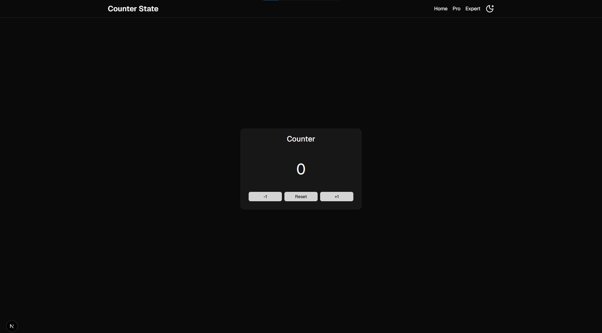
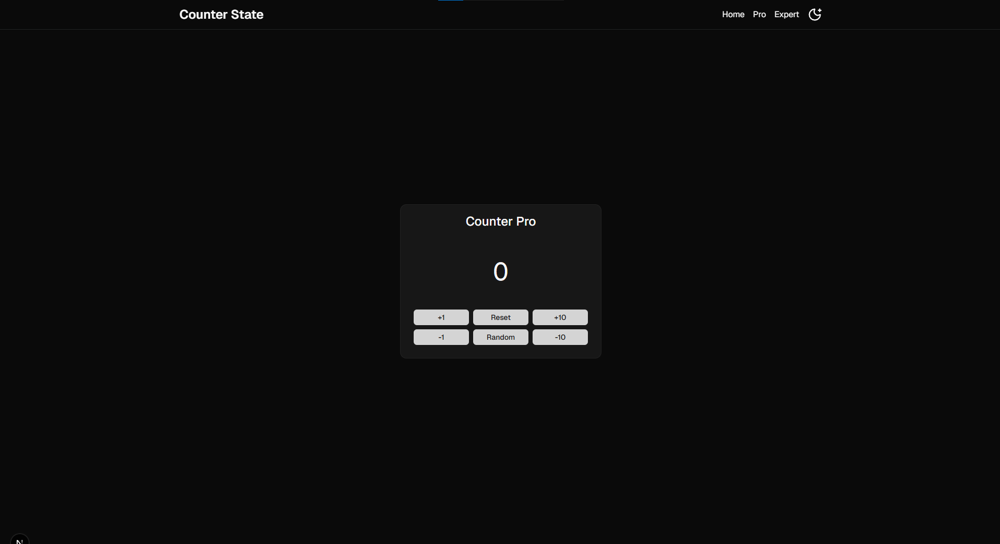
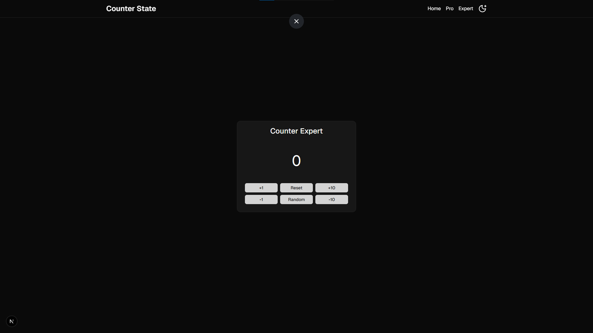

<div align="center">

# 🔢 Counter State

### A Progressive, Production-Grade Counter Application Built with Next.js 16, React 19 & Jotai

<br />


<br />

> **Counter State** is a beautifully crafted, three-tier counter application that progressively demonstrates React state management patterns — from basic local state all the way up to async animations, global atom-based state, and toast-driven UX feedback. Built on the bleeding edge of the React ecosystem with Next.js 16, React 19, Tailwind CSS 4, and Motion (Framer Motion v12).

<br />

---

</div>

## 📸 Preview

<br />

### 🧩 Basic Counter

<p align="center">
  
</p>

> A clean, minimal counter with smooth sliding-number animations, increment, decrement, and reset.

---

### ⚡ Counter Pro

<p align="center">
  
</p>

> An intermediate counter with bulk operations (+10 / -10), random number generation, and boundary-aware disabled states.

---

### 🧠 Counter Expert

<p align="center">
  
</p>

> The most advanced tier: Jotai global state, async animated counting loops, loading states, and toast notifications.

---

## 🚀 Introduction

**Counter State** is not just another counter — it's a **progressive showcase of modern React architecture**. The project is structured as three distinct experiences, each layered with increasing complexity:

| Tier                  | Route     | Complexity   | State Strategy                    |
| --------------------- | --------- | ------------ | --------------------------------- |
| 🧩 **Basic Counter**  | `/`       | Beginner     | `useState` local state            |
| ⚡ **Counter Pro**    | `/pro`    | Intermediate | `useState` + boundary guards      |
| 🧠 **Counter Expert** | `/expert` | Advanced     | Jotai atom + async loops + toasts |

Whether you're learning React state management patterns, exploring animation-first UI, or looking for a well-architected Next.js 16 / React 19 starter — this project delivers all three.

---

## ✨ Feature Overview

### 🧩 Basic Counter — `/`

The simplest tier. Clean and focused.

| Feature                         | Details                                               |
| ------------------------------- | ----------------------------------------------------- |
| ➕ **Increment**                | `+1` — adds one to current count                      |
| ➖ **Decrement**                | `-1` — subtracts one from current count               |
| 🔄 **Reset**                    | Returns count to `0`                                  |
| 🎬 **Sliding Number Animation** | Each digit animates independently with spring physics |
| 🎨 **Hover Color Feedback**     | Yellow on decrement, Red on reset, Green on increment |

---

### ⚡ Counter Pro — `/pro`

Adds power-user controls and boundary awareness.

| Feature                         | Details                                                 |
| ------------------------------- | ------------------------------------------------------- |
| ➕ **Increment**                | `+1` with upper-bound guard (`count > 99` → disabled)   |
| ➖ **Decrement**                | `-1` with lower-bound guard (`count < -100` → disabled) |
| ⏩ **Bulk +10**                 | Jump forward 10 in one click (disabled above 99)        |
| ⏪ **Bulk -10**                 | Jump back 10 in one click (disabled below -100)         |
| 🎲 **Random Number**            | Generates a random float in the range `[-100, 100]`     |
| 🚫 **Disabled State**           | Buttons intelligently disable at count boundaries       |
| 🎬 **Sliding Number Animation** | Shared animated number display component                |

---

### 🧠 Counter Expert — `/expert`

The flagship tier. Full async power with global state.

| Feature                           | Details                                                                              |
| --------------------------------- | ------------------------------------------------------------------------------------ |
| 🌐 **Global State (Jotai)**       | Uses `useAtom(mainValue)` — persists across navigations within session               |
| ➕ **Increment**                  | Synchronous `+1`                                                                     |
| ➖ **Decrement**                  | Synchronous `-1`                                                                     |
| ⏩ **Async +10 Loop**             | Counts up 10 steps, one per 100ms — visually animated                                |
| ⏪ **Async -10 Loop**             | Counts down 10 steps, one per 100ms — visually animated                              |
| 🎲 **Animated Random**            | Counts step-by-step (50ms/step) from current value to random target in `[-100, 100]` |
| ⏳ **Loading State**              | `loading` flag blocks duplicate random triggers during animation                     |
| 🔔 **Toast: Warning**             | Fires `toast.warning("Please Wait")` when random animation begins                    |
| ✅ **Toast: Success**             | Fires `toast.success("Reset Done")` on successful reset                              |
| 🔒 **Reset Disabled During Load** | Reset and Random buttons are disabled while animation is running                     |
| 🎬 **Sliding Number Animation**   | Shared spring-physics digit animation component                                      |

---

## 🎬 The `SlidingNumber` Animation Engine

The crown jewel of the UI layer is the **custom `SlidingNumber` component** — a digit-roller animation built on top of `motion/react` (Motion v12 / Framer Motion).

### How it works

```
Count: 42 → 43
         ↓
  Digit "4" stays still
  Digit "3" springs from 2 → 3 with physics
```

- Each decimal place gets its own **`SlidingNumberRoller`** — an independently animated slot
- A vertical column of digits `0–9` is rendered per slot; the visible one slides into view via a **spring motion value**
- **`useSpring`** drives smooth, physics-based easing — not a flat CSS transition
- **`react-use-measure`** dynamically measures the digit height for pixel-perfect alignment
- Negative sign (`-`) is rendered as a separate animated character
- Supports integers, decimals, and sign transitions
- **`useIsInView`** — a custom hook wrapping `motion/react`'s `useInView` — triggers animation only when the component enters the viewport

### Key animation primitives used

| Primitive        | Source              | Purpose                                        |
| ---------------- | ------------------- | ---------------------------------------------- |
| `useSpring`      | `motion/react`      | Physics-based value animation                  |
| `useMotionValue` | `motion/react`      | Imperatively controlled motion value           |
| `useTransform`   | `motion/react`      | Maps motion value to rendered position         |
| `useInView`      | `motion/react`      | Scroll-based visibility detection              |
| `useMeasure`     | `react-use-measure` | Real-time DOM size measurement                 |
| `useIsInView`    | Custom hook         | Wrapper combining ref forwarding + `useInView` |

---

## 🌐 Global State Architecture (Jotai)

The **Expert** tier introduces **Jotai** — a minimalist, atomic state management library for React.

```ts
// src/lib/atom.ts
import { atom } from "jotai";

export const initValue = 0;
export const mainValue = atom(initValue);
```

```tsx
// Usage in Expert.tsx
const [count, setCount] = useAtom(mainValue);
```

**Why Jotai?**

- Zero boilerplate — no providers, no reducers, no context wiring
- The `mainValue` atom persists state **across page navigations** within the session
- Functional updater pattern (`setCount(count => count + 1)`) used inside async loops for correctness — avoids stale closures

---

## 🔔 Toast Notification System

Toast notifications are handled by **react-toastify v11**, integrated globally via `ThemeProvider`.

```tsx
// ThemeProvider renders Toastify alongside children
<NextThemesProvider {...props}>
  {children}
  <Toastify />
</NextThemesProvider>
```

```tsx
// Toastify configuration
<ToastContainer
  position="bottom-right"
  autoClose={2500}
/>
```

| Event                   | Toast Type | Message         |
| ----------------------- | ---------- | --------------- |
| Random animation starts | ⚠️ Warning | `"Please Wait"` |
| Reset completes         | ✅ Success | `"Reset Done"`  |

---

## 🌙 Dark Mode & Theming

**next-themes** powers the theme system with:

- **Default theme: Dark** — `defaultTheme="dark"`, `enableSystem={false}`
- Animated **Sun / Moon** toggle button using Tailwind's `dark:` variant
- CSS class-based theming (`attribute="class"`)
- `suppressHydrationWarning` on `<html>` to prevent SSR flicker
- Smooth icon rotation transition: `transition-all duration-300` with `-rotate-90 → rotate-0`

---

## 🧭 Navigation & Routing

The fixed header provides top-level navigation across all three counter tiers.

```
Counter State (logo → /)    Home    Pro    Expert    [🌙 Toggle]
```

Built with **Next.js App Router** — each route is a Server Component page wrapping a Client Component counter:

```
/          → src/app/page.tsx          → <Counter />
/pro       → src/app/pro/page.tsx      → <Pro />
/expert    → src/app/expert/page.tsx   → <Expert />
```

---

## 🆚 Feature Comparison Table

| Feature                  | 🧩 Basic | ⚡ Pro | 🧠 Expert |
| ------------------------ | :------: | :----: | :-------: |
| +1 Increment             |    ✅    |   ✅   |    ✅     |
| -1 Decrement             |    ✅    |   ✅   |    ✅     |
| Reset                    |    ✅    |   ✅   |    ✅     |
| +10 Bulk                 |    ❌    |   ✅   |    ✅     |
| -10 Bulk                 |    ❌    |   ✅   |    ✅     |
| Boundary Disabled State  |    ❌    |   ✅   |    ❌     |
| Random Number            |    ❌    |   ✅   |    ✅     |
| Async Animated Loop      |    ❌    |   ❌   |    ✅     |
| Loading State            |    ❌    |   ❌   |    ✅     |
| Toast Notifications      |    ❌    |   ❌   |    ✅     |
| Global State (Jotai)     |    ❌    |   ❌   |    ✅     |
| Sliding Number Animation |    ✅    |   ✅   |    ✅     |
| Spring Physics           |    ✅    |   ✅   |    ✅     |

---

## 📦 Tech Stack

| Technology               | Version    | Role                                           |
| ------------------------ | ---------- | ---------------------------------------------- |
| ⚡ **Next.js**           | `^16.2.1`  | Full-stack React framework (App Router)        |
| ⚛️ **React**             | `^19.2.4`  | UI library with React Compiler                 |
| 🟦 **TypeScript**        | `^6.0.2`   | Type safety across the entire codebase         |
| 🎨 **Tailwind CSS**      | `^4.2.2`   | Utility-first CSS (v4 with PostCSS plugin)     |
| 🌐 **Jotai**             | `^2.19.0`  | Atomic global state management                 |
| 🎬 **Motion**            | `^12.38.0` | Physics-based animation (`motion/react`)       |
| 🔔 **react-toastify**    | `^11.0.5`  | Toast notification system                      |
| 🌙 **next-themes**       | `^0.4.6`   | Dark/light mode with SSR support               |
| 📐 **react-use-measure** | `^2.1.7`   | DOM element size measurement                   |
| 🎭 **shadcn/ui**         | `^4.1.1`   | Accessible component primitives                |
| 🔡 **@base-ui/react**    | `^1.3.0`   | Low-level accessible UI base                   |
| 🖼️ **lucide-react**      | `^1.7.0`   | Icon library (Sun, MoonStar)                   |
| 🔤 **Geist Sans / Mono** | Next Font  | Vercel's Geist typeface via `next/font/google` |
| 📦 **sharp**             | `^0.34.5`  | High-performance image processing              |
| 🧹 **ESLint**            | `^10.1.0`  | Linting with Next.js + react-hooks plugin      |
| 💅 **Prettier**          | `^3.8.1`   | Code formatting with Tailwind plugin           |
| 🐦 **Bun**               | latest     | Package manager & runtime                      |

---

## 🗂️ Folder Structure

```
counter-state/
├── public/
│   ├── counter.png              # Basic Counter screenshot
│   ├── counter-pro.png          # Counter Pro screenshot
│   ├── counter-expert.png       # Counter Expert screenshot
│   └── favicon.ico
│
├── src/
│   ├── app/
│   │   ├── layout.tsx           # Root layout — ThemeProvider, Header, fonts
│   │   ├── globals.css          # Global styles & Tailwind directives
│   │   ├── page.tsx             # Route: / → Basic Counter
│   │   ├── pro/
│   │   │   └── page.tsx         # Route: /pro → Counter Pro
│   │   └── expert/
│   │       └── page.tsx         # Route: /expert → Counter Expert
│   │
│   ├── components/
│   │   ├── customui/
│   │   │   ├── Counter.tsx      # Basic Counter component
│   │   │   ├── Pro.tsx          # Counter Pro component
│   │   │   ├── Expert.tsx       # Counter Expert component (Jotai + async)
│   │   │   └── sliding-number.tsx  # Spring-animated digit roller
│   │   ├── shadcnui/
│   │   │   ├── button.tsx       # shadcn Button with CVA variants
│   │   │   ├── card.tsx         # shadcn Card primitives
│   │   │   └── Toastify.tsx     # ToastContainer wrapper
│   │   ├── Header/
│   │   │   └── Header.tsx       # Fixed navigation header
│   │   ├── Providers/
│   │   │   └── ThemeProvider.tsx  # next-themes + Toastify provider
│   │   └── ThemeToggleButton.tsx  # Animated dark/light toggle
│   │
│   ├── hooks/
│   │   └── use-is-in-view.tsx   # Custom hook: ref forwarding + useInView
│   │
│   └── lib/
│       ├── atom.ts              # Jotai atom definitions
│       ├── fonts.ts             # Geist Sans & Geist Mono configuration
│       └── utils.ts             # Tailwind `cn()` utility
│
├── package.json
├── next.config.ts
├── tsconfig.json
├── postcss.config.mjs
├── eslint.config.mjs
└── .prettierrc
```

---

## 🛠️ Installation Guide

### Prerequisites

- **Node.js** `>=24.x.x`
- **npm** `>=11.x.x` (or Yarn / Bun)

### 1. Clone the Repository

```bash
git clone https://github.com/piyushsarkar-dev/counter-state.git
cd counter-state
```

### 2. Install Dependencies

**Using npm:**

```bash
npm install
```

**Using Yarn:**

```bash
yarn install
```

**Using Bun (recommended):**

```bash
bun install
```

### 3. Run the Development Server

**Using npm:**

```bash
npm run dev
```

**Using Yarn:**

```bash
yarn dev
```

**Using Bun:**

```bash
bun dev
```

Open [https://counter-state-nine.vercel.app/](https://counter-state-nine.vercel.app/) in your browser.

---

## 🖥️ Usage

### Available Routes

| URL                                            | Page           | Description                        |
| ---------------------------------------------- | -------------- | ---------------------------------- |
| `https://counter-state-nine.vercel.app/`       | Basic Counter  | Simple increment, decrement, reset |
| `https://counter-state-nine.vercel.app/pro`    | Counter Pro    | Bulk ops, random, boundary guards  |
| `https://counter-state-nine.vercel.app/expert` | Counter Expert | Async loops, Jotai state, toasts   |

### Available Scripts

```bash
# Start development server
npm run dev

# Build for production
npm run build

# Start production server
npm run start

# Run ESLint
npm run lint

# Lint + Build + Start (full production pipeline)
npm run prod
```

---

## 🔬 Key Implementation Patterns

### Async Counting Loop (Expert)

The animated `+10` / `-10` in Counter Expert is implemented with an `async` function and `await`-based delays — giving a real-time counting animation:

```ts
const plusTen = async () => {
  for (let i = 0; i < 10; i++) {
    await new Promise((r) => setTimeout(r, 100)); // 100ms per step
    setCount((count) => count + 1); // functional updater — no stale closure
  }
};
```

### Animated Random Number (Expert)

The random function animates step-by-step from the current value to the random target:

```ts
const randomNumber = async () => {
  if (loading) return;
  Setloading(true);
  toast.warning("Please Wait");

  const total = Math.random() * (-100 - 100) + 100; // range: [-100, 100]

  for (let i = count; i < total; i++) {
    await new Promise((r) => setTimeout(r, 50));
    setCount((count) => count + 1);
  }
  for (let i = count; i > total; i--) {
    await new Promise((r) => setTimeout(r, 50));
    setCount((count) => count - 1);
  }

  Setloading(false);
};
```

### Jotai Atom

```ts
// src/lib/atom.ts
import { atom } from "jotai";

export const initValue = 0;
export const mainValue = atom(initValue); // shared across the app
```

---

## 👨‍💻 Author

<div align="center">

### **Piyush Sarkar**

[](https://github.com/piyushsarkar-dev)
[](https://github.com/piyushsarkar-dev/counter-state)

</div>

---

## 📄 License

This project is licensed under the **MIT License** — see the [LICENSE](LICENSE) file for details.

---

<div align="center">

**Built with ❤️ using Next.js 16, React 19 & Motion**

⭐ If you found this project useful, please consider giving it a star on GitHub!

</div>
